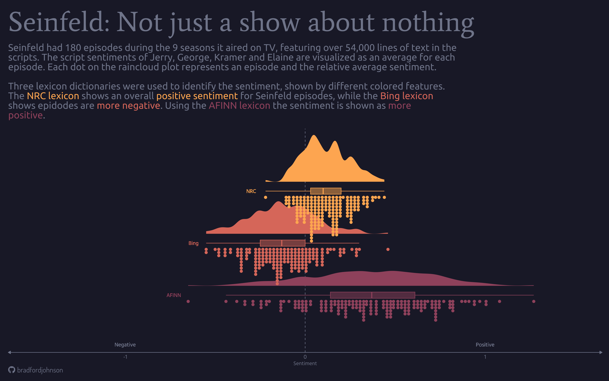
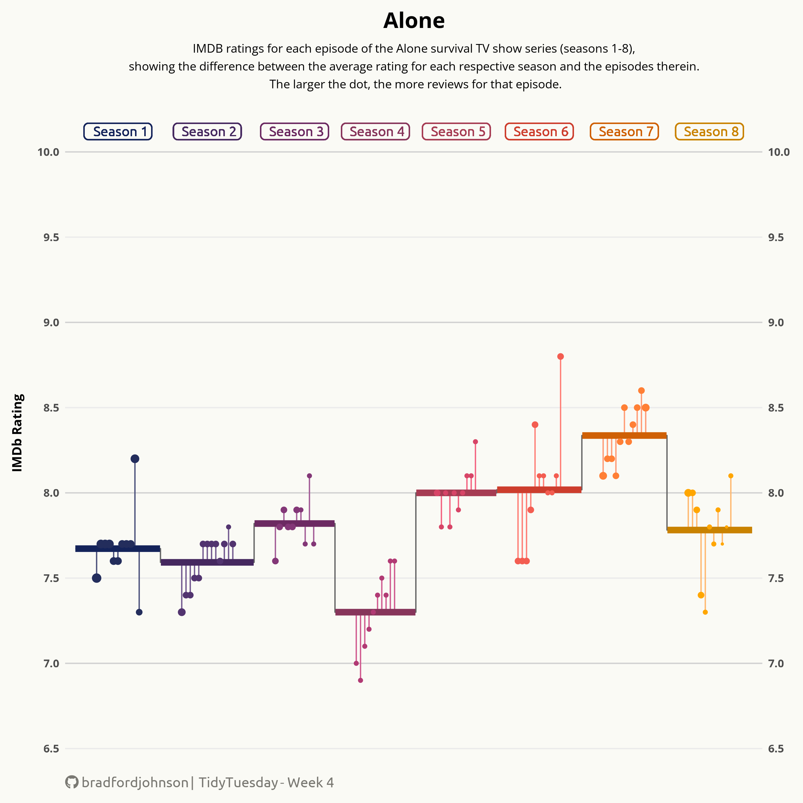

#   Howdy! I'm Ford

I'm a data analyst, which is a more concise way of saying: I help businesses make data-driven decisions and solve problems.

Tools: `R`, `Python`, `SQL`, `Tableau`, `Excel`

Hobbies: `Hiking`, `Photography`
<!--- WORK IN PROGRESS --->
**Check out my portfolio I made with `R` and `Quarto`:** [ford-johnson.com](https://ford-johnson.com/)
<!--- WORK IN PROGRESS --->
<!---**Also, check out my `tidytuesday` repo: [here](https://github.com/bradfordjohnson/tidytuesday)**--->

Gallery
---
<!--- SEND ALL LINKS TO REPOS --->
 

  
    

 

  
   
  

  
 <!--- WORK IN PROGRESS --->
 Social
---

<!--- space --->
  &emsp;

  <!--- space --->
  &emsp;

<!--- WORK IN PROGRESS --->
<!---📊 GitHub stats --->
<!--- --- --->
<!--- 
 --->
 <!---  --->

 <!---  --->
